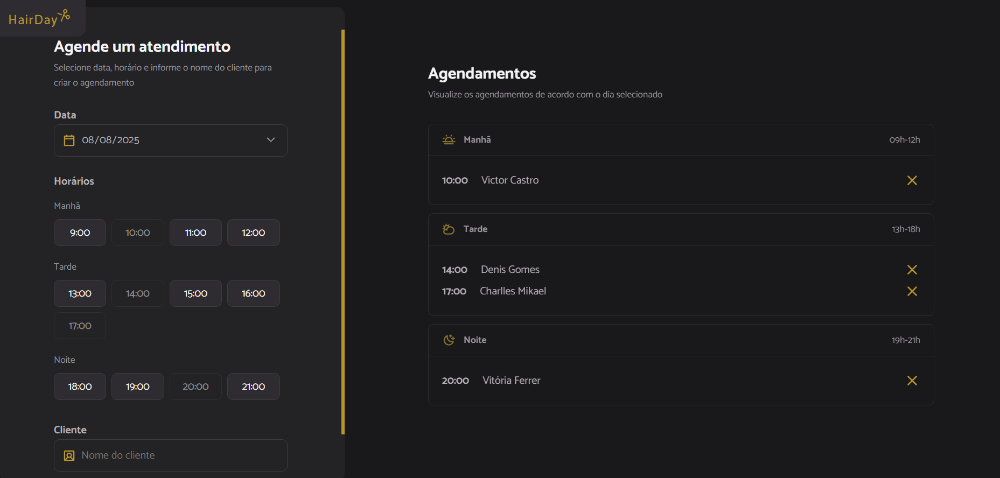

 

    

## 👩‍💻 Aprendizados
Durante o desenvolvimento do Hairday, aprendi e apliquei vários conceitos fundamentais para projetos web completos, tanto no fronted quanto no backend. Alguns dos principais aprendizados incluem:
 --> Webpack: Configurei do zero um bundler para agrupar os arquivos do frontend, criando um ambiente de desenvolvimento moderno com recarregamento automático, organização modular e build otimizado.
 
 --> Babel: Usei o Babel para transpilação de código JavaScript moderno (ES6+) para versões mais compatíveis com navegadores, o que me ajudou a entender como funciona a retrocompatibilidade em projetos web.
 
 --> json-server: Simulei uma API REST completa com json-server, o que me permitiu testar requisições HTTP (GET, POST, DELETE) e trabalhar com dados dinâmicos de forma rápida.
 
 --> Integração Frontend + API: Aprendi a integrar uma interface web com uma API, utilizando fetch e async/await, lidando com estados assíncronos, controle de erros e atualização de interface com base em dados da API.
 
 --> Controle de versão com Git: Ganhei mais prática com Git e GitHub, aprendendo a lidar com o versionamento, .gitignore, organização de commits, remoção de arquivos da indexação, entre outros detalhes.
 
 --> Automação com npm scripts: Configurei scripts no package.json para facilitar a execução de tarefas comuns como iniciar o servidor ou buildar o projeto.
 
Este projeto me ajudou a entender como diversas ferramentas e conceitos se conectam em um fluxo de desenvolvimento moderno. Foi uma experiência valiosa para solidificar meu conhecimento em desenvolvimento web.

## 💻 Estrutura do Projeto
hadirday_project

├── dist/                 # Build gerado pelo Webpack (ignorado pelo Git)

├── node_modules/         # Dependências (ignorado pelo Git)

├── src/                  # Código fonte do frontend

├── .gitignore

├── index.html

├── package-lock.json

├── package.json

├── README.md

├── server.json           # Banco de dados fake do json-server

└──  webpack.config.js

## 💾 Pré Requisitos
--> Node.js instalado

--> npm ou yarn

## 🚀 Como Rodar
1. Rodar a API com json-server:

 --> npm install -g json-server   # (se ainda não tiver instalado)
 
 --> npm run server               # (para inicar a API fake na porta 3333)

2. Rodar o frontend com Webpack:
   
 --> npm install
 
 --> npm run dev                  # (Isso inicia o servidor Webpack para o frontend)

3. Uso:
   
 --> Abra o navegador e acesse o endereço que o Webpack informar.
 
 --> Faça agendamentos que serão salvos na API fake do json-server.

## ⚙️ Tecnologias
Esse projeto foi desenvolvido usando as seguintes tecnologias:

- Node.js
- json-server
- Webpack
- Babel
- HTML
- CSS
- JavaScript (ES6+)
- GIT E Github

## 🏷️ Layout
Você pode visualizar o layout do projeto através [desse link](https://www.figma.com/community/file/1360316357733167308).
É necessário ter uma conta no [Figma](https://www.figma.com).
